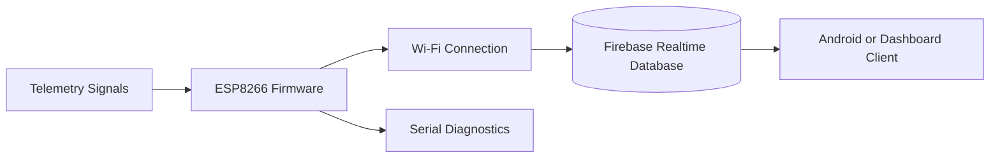

# Real-time IoT Telemetry Acquisition

**ESP8266 telemetry prototype that publishes vehicle-style sensor values to Firebase for real-time client consumption.**


## Problem Statement

Embedded telemetry systems need a reliable path from constrained devices to a cloud data store while keeping network credentials and backend configuration out of firmware source control.

## Architecture



## Telemetry Contract

The sketch demonstrates one-second updates for:

- speed-like telemetry;
- accumulator state of charge;
- acceleration;
- estimated range; and
- append-only diagnostic logs.

The current values are generated counters and must be replaced with calibrated sensor reads for a physical deployment.

## Tech Stack

- C++ / Arduino
- ESP8266 Wi-Fi
- Firebase Realtime Database
- Arduino CLI validation in GitHub Actions

## Setup

```bash
cp config.example.h config.h
```

Populate local development values in `config.h`, select an ESP8266-compatible board in Arduino IDE, and upload `Telemetry_Data.ino`.

`config.h` is excluded from Git. Do not commit Wi-Fi passwords, Firebase tokens, or mobile configuration files.

## Security

- Use Firebase Authentication and least-privilege database rules instead of long-lived database secrets in production firmware.
- Rotate any credential ever committed to repository history.
- Restrict write paths by device identity.
- Add TLS certificate and firmware-update planning for deployed hardware.

## Testing

The GitHub Actions workflow performs a firmware compile check. Hardware-in-the-loop tests, reconnect behavior, queueing, and packet-loss measurement are not yet included.

## Future Improvements

- Replace counters with sensor drivers and calibration
- Add offline buffering and retry with backoff
- Use device identity rather than a shared token
- Define timestamped, versioned telemetry records
- Add dashboard latency and packet-loss observability
